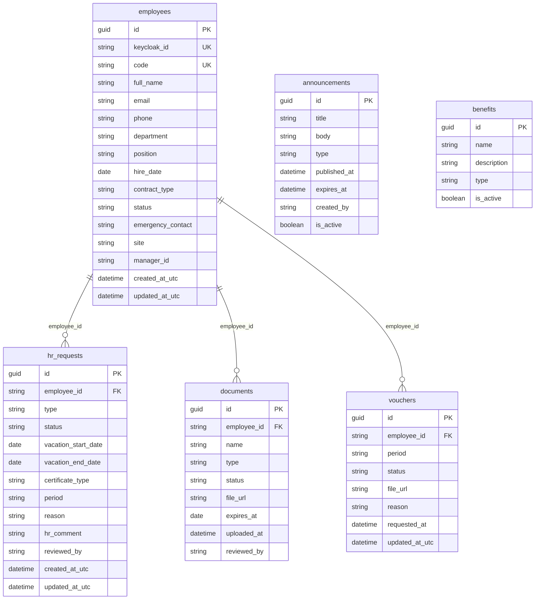

# Base de Datos — PeoplePortal

PostgreSQL 16 con Entity Framework Core 9. Naming convention: `snake_case`.

## Diagrama ER



---

## Tablas y descripción

| Tabla | Descripción |
|---|---|
| `employees` | Colaboradores registrados en el sistema |
| `hr_requests` | Solicitudes (vacaciones, constancias, vouchers, permisos) |
| `documents` | Documentos del expediente digital del colaborador |
| `vouchers` | Vouchers de pago solicitados/cargados por nómina |
| `announcements` | Comunicados internos publicados por RRHH |
| `benefits` | Catálogo de beneficios de la empresa |

---

## Convenciones

| Convención | Ejemplo |
|---|---|
| Tablas en snake_case plural | `hr_requests` |
| Columnas en snake_case | `employee_id`, `created_at_utc` |
| Primary keys | `id` (GUID) |
| Foreign keys | `{tabla_singular}_id` |
| Índices | `ix_{tabla}_{columna}` |
| Timestamps en UTC | `created_at_utc`, `updated_at_utc` |

---

## Migraciones EF Core

```bash
# Aplicar migraciones (docker-compose)
docker-compose run --rm migrate

# Aplicar migraciones (K8s)
kubectl apply -f k8s/migration-job.yaml
kubectl wait --for=condition=complete job/peopleportal-migrations \
  -n peopleportal --timeout=180s
```

Las migraciones se encuentran en `src/PeoplePortal.Infrastructure/Persistence/Migrations/`.
