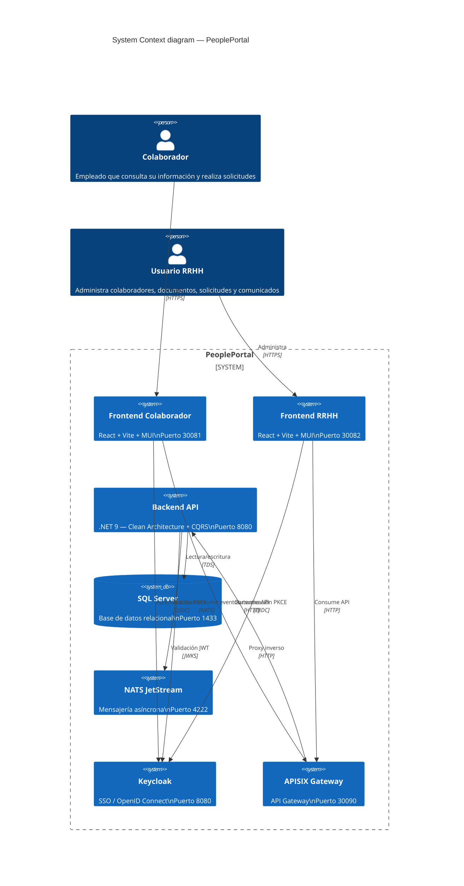
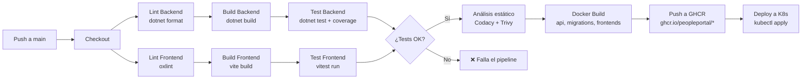
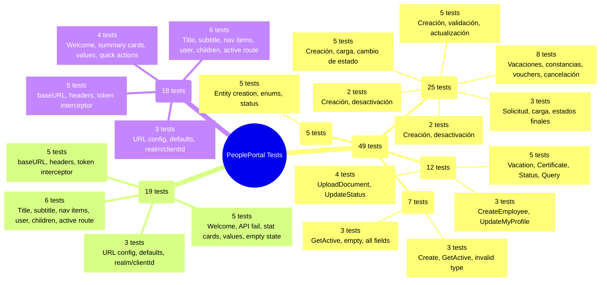
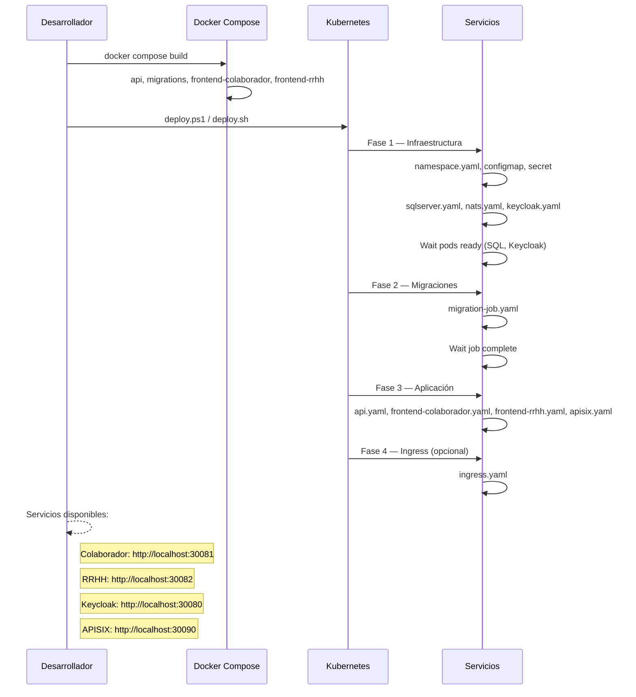
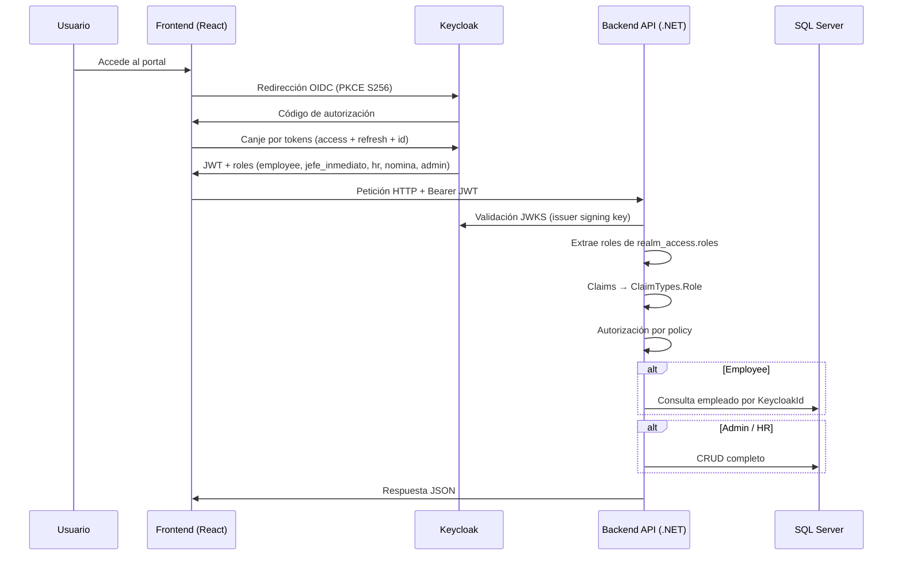
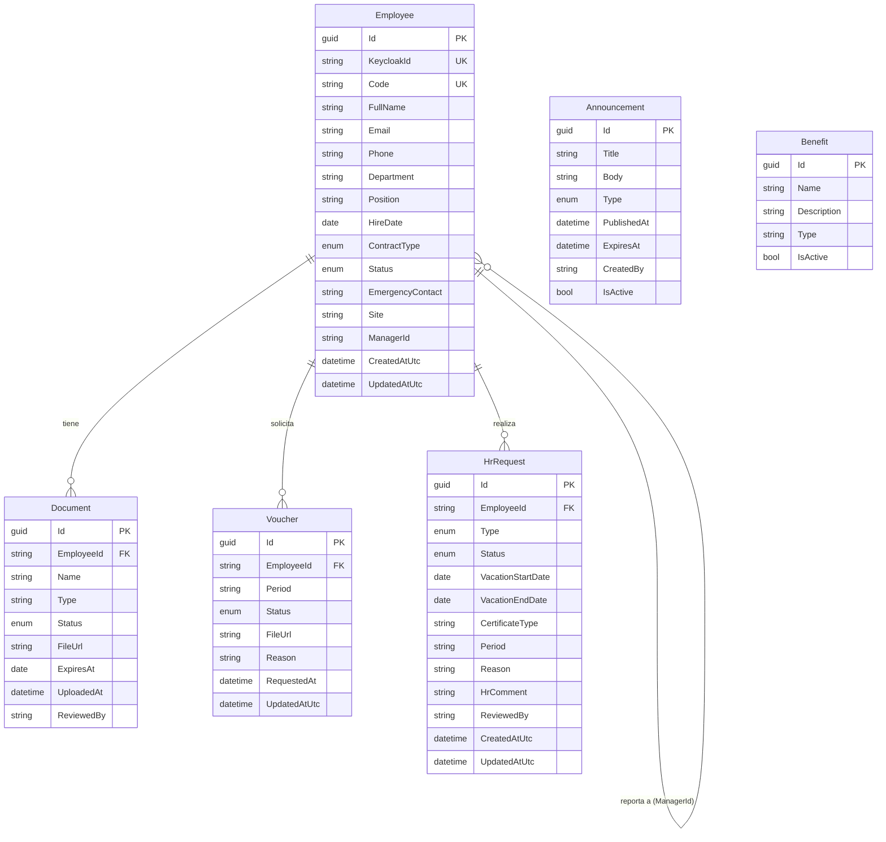

# PeoplePortal — Documentación del Proyecto

## 1. Arquitectura del Sistema (C4 — Diagrama de Contexto)

El sistema se despliega en **Docker Desktop Kubernetes** sobre el namespace `peopleportal`. Los frontends redirigen `/api/` directamente al backend via Nginx. APISIX está disponible como gateway alternativo (`NodePort 30090`). Keycloak provee autenticación SSO con flujo PKCE S256. NATS JetStream maneja eventos de dominio (ej. `hr.request.submitted`) para integración asíncrona.

---

## 2. Pipeline CI/CD

**Referencias:**
- **GitHub Container Registry (GHCR):** las imágenes se etiquetan y publican como `ghcr.io/peopleportal/api:latest`, etc.
- **Codacy:** análisis de calidad y cobertura de código (`PeoplePortal-BackEnd/.codacy.yml`).
- **Trivy:** escaneo de vulnerabilidades en imágenes Docker.
- **Branch protection:** la rama `main` está protegida; requiere pipeline verde para fusionar.

---

## 3. Estrategia de Pruebas

**Stack de testing:**
| Capa | Framework | Assertions | Mocks |
|------|-----------|------------|-------|
| Backend Domain | xUnit | FluentAssertions | — |
| Backend Application | xUnit | FluentAssertions | NSubstitute |
| Frontend | Vitest | Testing Library + jest-dom | MSW + vi.mock |
| Cobertura | coverlet | — | — |

---

## 4. Proceso de Despliegue

**Puertos NodePort expuestos:**

| Servicio | Puerto |
|----------|--------|
| Frontend Colaborador | 30081 |
| Frontend RRHH | 30082 |
| Keycloak | 30080 |
| APISIX Gateway | 30090 |

---

## 5. Flujo de Autenticación

**Políticas de autorización** (`Program.cs:109-125`):

| Policy | Rol requerido |
|--------|---------------|
| EmployeePolicy | `employee` |
| ManagerPolicy | `jefe_inmediato` |
| HrPolicy | `hr` |
| NominaPolicy | `nomina` |
| AdminPolicy | `admin` |

Keycloak se configura con:
- **Realm:** `peopleportal`
- **Client ID frontend:** `peopleportal-frontend` (PKCE, S256)
- **Client ID backend:** `peopleportal-api` (confidencial)
- **Audience:** `peopleportal-api`

---

## 6. Diagrama Entidad-Relación

**Descripción de entidades:** (basado en `PeoplePortal-BackEnd/src/PeoplePortal.Domain/Entities/`)

| Entidad | Propósito | Estados clave |
|---------|-----------|---------------|
| **Employee** | Colaborador registrado en la plataforma. Vinculado a Keycloak via `KeycloakId`. | `Active`, `Inactive`, `OnLeave`, `Terminated` |
| **Document** | Documento digital asociado a un empleado. Pueden ser contratos, constancias, identificaciones, etc. | `Available`, `Pending`, `InReview`, `Approved`, `Rejected`, `Expired` |
| **Voucher** | Comprobante de pago solicitado por el empleado a nómina. | `Requested`, `InProcess`, `AvailableForDownload`, `Rejected`, `Completed` |
| **HrRequest** | Solicitud genérica a RRHH: vacaciones, constancias, vouchers, permisos, actualización de datos. | `Submitted`, `InReview`, `Approved`, `Rejected`, `Cancelled` |
| **Announcement** | Comunicado interno publicado por RRHH. | `IsActive: true/false` |
| **Benefit** | Beneficio informativo disponible para colaboradores. | `IsActive: true/false` |

**Tipos de solicitud (`RequestType`):** Vacation (1), Certificate (2), Voucher (3), Permission (4), DataUpdate (5), Other (6).
