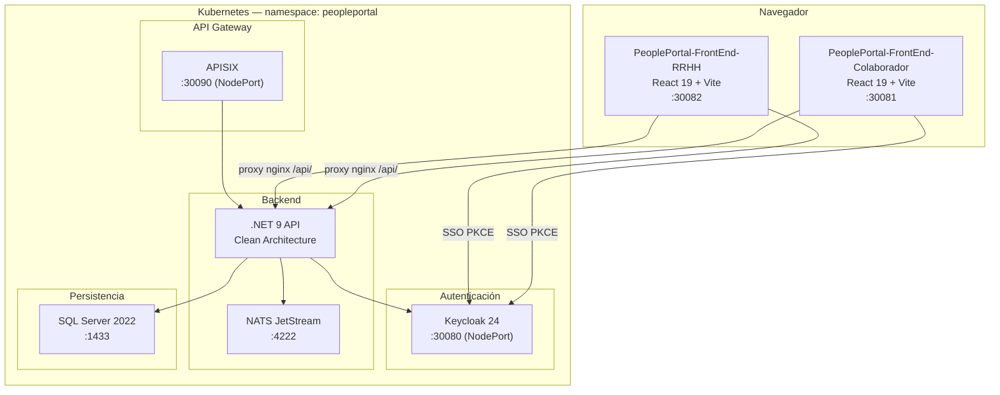

# PeoplePortal — Arquitectura Global

## Visión general

PeoplePortal es una plataforma de autoservicio para colaboradores y RRHH compuesta por tres servicios independientes desplegados en Kubernetes.



## Repositorio — Estructura

```
ProyectoIA-Forza/
├── PeoplePortal-BackEnd/       ← .NET 9 API (Clean Architecture)
│   ├── docs/                   ← Documentación backend (arquitectura, BD, seguridad)
│   ├── k8s/                    ← Manifiestos backend (api, sqlserver, nats, migrations)
│   ├── src/                    ← Código fuente (Api, Application, Domain, Infrastructure)
│   ├── tests/                  ← Tests unitarios
│   └── Dockerfile
│
├── PeoplePortal-FrontEnd-Colaborador/  ← React 19 (portal del empleado)
│   ├── docs/                   ← Documentación frontend colaborador
│   ├── k8s/                    ← Manifiesto frontend-colaborador
│   ├── src/                    ← Código fuente
│   └── Dockerfile
│
├── PeoplePortal-FrontEnd-RRHH/         ← React 19 (panel administrativo RRHH)
│   ├── docs/                   ← Documentación frontend RRHH
│   ├── k8s/                    ← Manifiesto frontend-rrhh
│   ├── src/                    ← Código fuente
│   └── Dockerfile
│
├── k8s/                        ← Manifiestos globales (namespace, secrets, keycloak, apisix)
├── docs/                       ← Documentación global (esta carpeta)
├── deploy/                     ← Scripts de build y deploy (PowerShell / bash)
└── docker-compose.yml          ← Compose raíz para build de imágenes
```

## Puertos NodePort (K8s local — Docker Desktop)

| Servicio | Puerto | URL |
|---|---|---|
| Keycloak | 30080 | `http://localhost:30080` |
| Frontend Colaborador | 30081 | `http://localhost:30081` |
| Frontend RRHH | 30082 | `http://localhost:30082` |
| APISIX | 30090 | `http://localhost:30090` |

## Roles de Keycloak

| Rol | Descripción |
|---|---|
| `employee` | Colaborador — acceso al portal del colaborador |
| `jefe_inmediato` | Jefe — puede aprobar solicitudes de su equipo |
| `hr` | RRHH — acceso completo al panel administrativo |
| `nomina` | Nómina — puede cargar vouchers de pago |
| `admin` | Administrador — gestión de usuarios y configuración |
