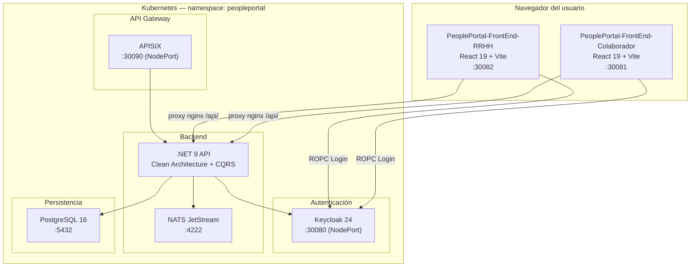
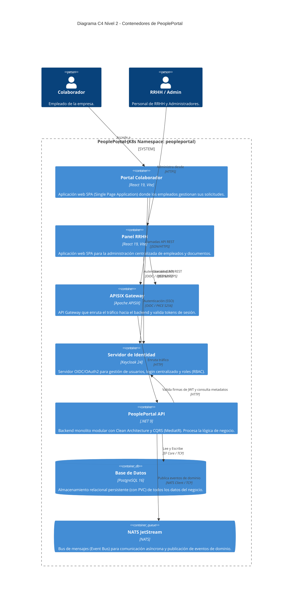

# PeoplePortal — Arquitectura Global

## Visión general del sistema

PeoplePortal es una plataforma de autoservicio para colaboradores y RRHH, compuesta por tres servicios independientes coordinados a través de Kubernetes y un API Gateway.



---

## Diagrama C4 Nivel 2: Contenedores

Este diagrama detalla los contenedores principales del sistema, sus responsabilidades tecnológicas y cómo interactúan internamente dentro del clúster Kubernetes.



---

## Puertos NodePort (K8s local — Docker Desktop)

| Servicio | Puerto | URL |
|---|---|---|
| Keycloak | 30080 | `http://localhost:30080` |
| Frontend Colaborador | 30081 | `http://localhost:30081` |
| Frontend RRHH | 30082 | `http://localhost:30082` |
| APISIX Gateway | 30090 | `http://localhost:30090` |
| API Backend (Swagger) | 30099 | `http://localhost:30099/swagger/index.html` |

---

## Roles de Keycloak

| Rol | Descripción | Portal de acceso |
|---|---|---|
| `employee` | Colaborador — consulta su información y crea solicitudes | Colaborador |
| `jefe_inmediato` | Jefe — aprueba solicitudes de su equipo | Colaborador |
| `hr` | RRHH — acceso completo al panel administrativo | RRHH |
| `nomina` | Nómina — carga vouchers de pago | RRHH |
| `admin` | Administrador — usuarios, roles y configuración | RRHH |

---

## Estructura del repositorio raíz

```
ProyectoIA-Forza/
├── README.md                          ← Descripción general del proyecto
├── CONTRIBUTING.md                    ← Guía de contribución global
├── docker-compose.yml                 ← Build de imágenes
├── docs/                              ← Documentación global
│   ├── README.md
│   ├── arquitectura.md                ← Este archivo
│   ├── despliegue.md
│   ├── plan-implementacion.md
│   └── adr/                           ← Architecture Decision Records
│
├── k8s/                               ← Manifiestos globales
│   ├── namespace.yaml
│   ├── secret.yaml
│   ├── keycloak.yaml
│   ├── keycloak-realm-configmap.yaml
│   ├── apisix.yaml
│   ├── apisix-configmap.yaml
│   └── ingress.yaml
│
├── deploy/                            ← Scripts build + deploy
│   ├── build.ps1
│   └── deploy.ps1
│
├── PeoplePortal-BackEnd/              ← Submódulo: .NET 9 API
│   └── docs/ → ver PeoplePortal-BackEnd/docs/README.md
│
├── PeoplePortal-FrontEnd-Colaborador/ ← Submódulo: React portal empleado
│   └── docs/ → ver PeoplePortal-FrontEnd-Colaborador/docs/README.md
│
└── PeoplePortal-FrontEnd-RRHH/        ← Submódulo: React panel RRHH
    └── docs/ → ver PeoplePortal-FrontEnd-RRHH/docs/README.md
```

---

## Documentación por subproyecto

| Subproyecto | Documentación técnica |
|---|---|
| Backend | [PeoplePortal-BackEnd/docs/](../PeoplePortal-BackEnd/docs/README.md) |
| Frontend Colaborador | [PeoplePortal-FrontEnd-Colaborador/docs/](../PeoplePortal-FrontEnd-Colaborador/docs/README.md) |
| Frontend RRHH | [PeoplePortal-FrontEnd-RRHH/docs/](../PeoplePortal-FrontEnd-RRHH/docs/README.md) |
