# Manual Técnico — Portal Colaborador (Empleados)

## Arquitectura del Sistema

```
  Usuario (Browser)
       │
       ▼
  ┌─────────────────────────────┐      ┌─────────────────┐
  │  Frontend React + MUI       │─────▶│  API ASP.NET     │
  │  Puerto :30081              │◀─────│  Puerto :30099   │
  │  PeoplePortal-FrontEnd-     │      └─────────────────┘
  │    Colaborador              │              │
  └─────────────────────────────┘              ▼
                                        ┌─────────────────┐
                                        │  SQL Server      │
                                        └─────────────────┘
                                                │
                                                ▼
                                        ┌─────────────────┐
                                        │  Keycloak Auth   │
                                        │  Puerto :30080   │
                                        └─────────────────┘
```

**Diferencia con el Portal RRHH:** El Portal Colaborador está orientado al empleado individual. Cada usuario solo puede ver y editar su propia información y crear solicitudes. No tiene acceso a la administración de otros empleados.

---

## Flujo de Navegación

### 1. Inicio de Sesión

El colaborador accede al portal y es redirigido a Keycloak para autenticarse. Tras la autenticación exitosa, se presenta el Dashboard con los módulos disponibles.

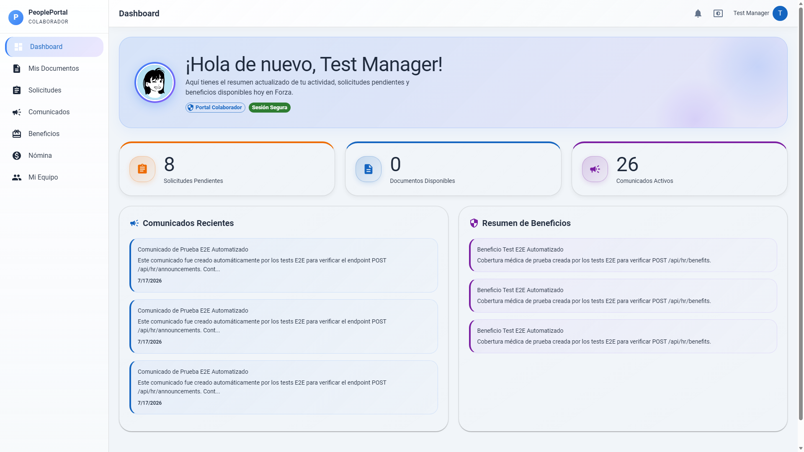

---

### 2. Perfil

**Módulo:** Mi Perfil

El colaborador puede editar su información de contacto: teléfono, ubicación, contacto de emergencia y teléfono de emergencia.

| Formulario de edición lleno | Confirmación de actualización |
|---|---|
| 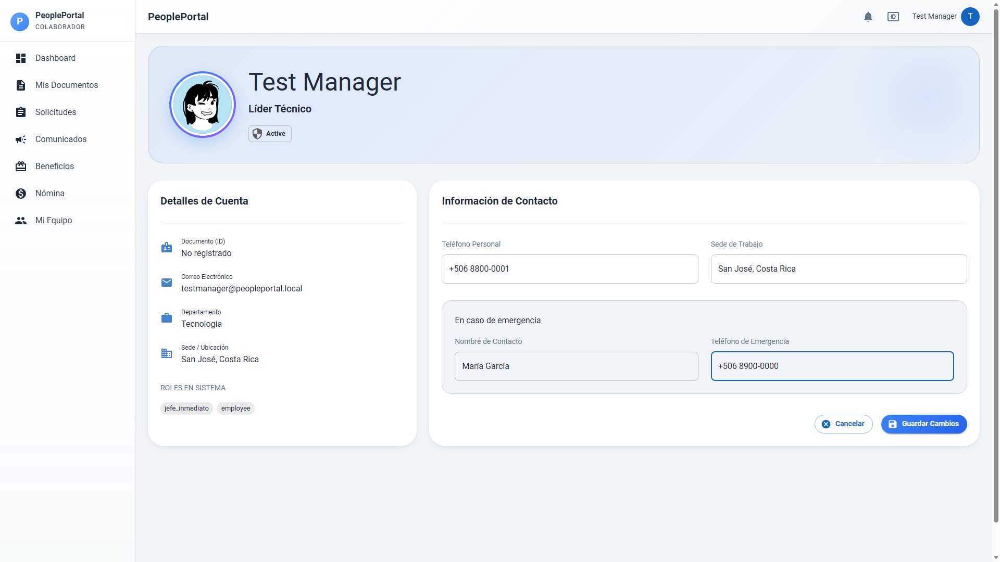 | 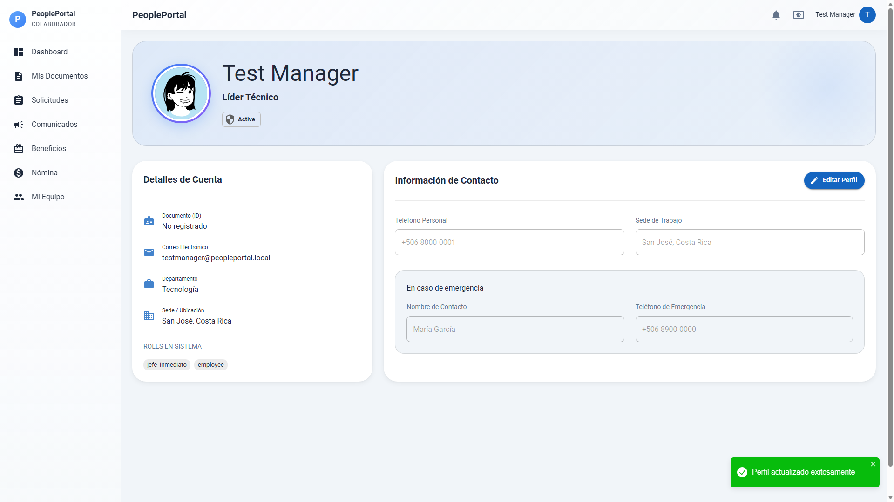 |

**API:** `PUT /api/employees/me`

---

### 3. Documentos Personales

**Módulo:** Documentos

El colaborador puede consultar los documentos que la administración ha subido a su expediente (contratos, constancias, etc.). La vista incluye un buscador para filtrar por nombre.

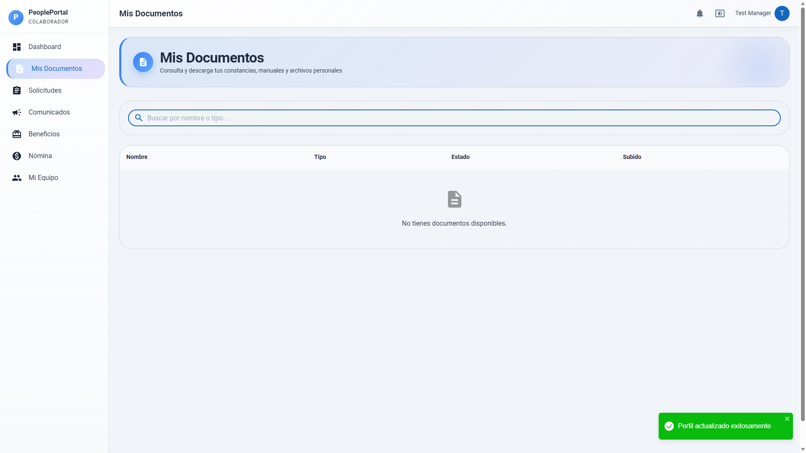

**API:** `GET /api/documents/me`

---

### 4. Solicitudes

**Módulo:** Mis Solicitudes

El colaborador puede crear solicitudes desde dos tabs:

**4.1 Solicitud de Vacaciones**

Selecciona fechas de inicio y fin, y agrega un motivo. La solicitud queda pendiente de aprobación por RRHH.

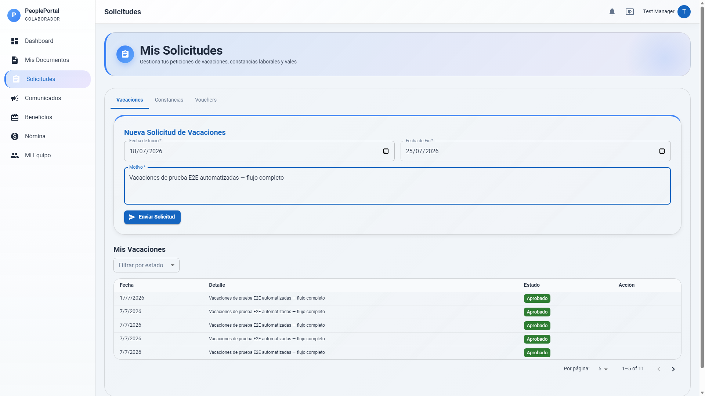

**API:** `POST /api/requests/vacation`

**4.2 Solicitud de Constancia**

Selecciona el tipo de constancia (Trabajo, Salarial, etc.) y agrega un motivo.

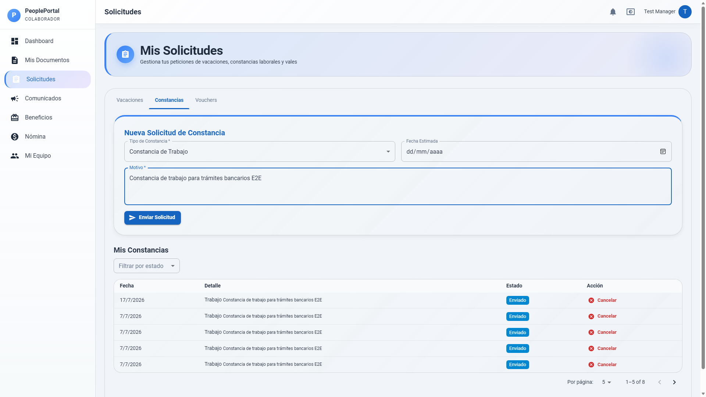

**API:** `POST /api/requests/certificate`

| Confirmación de solicitud creada |
|---|
| 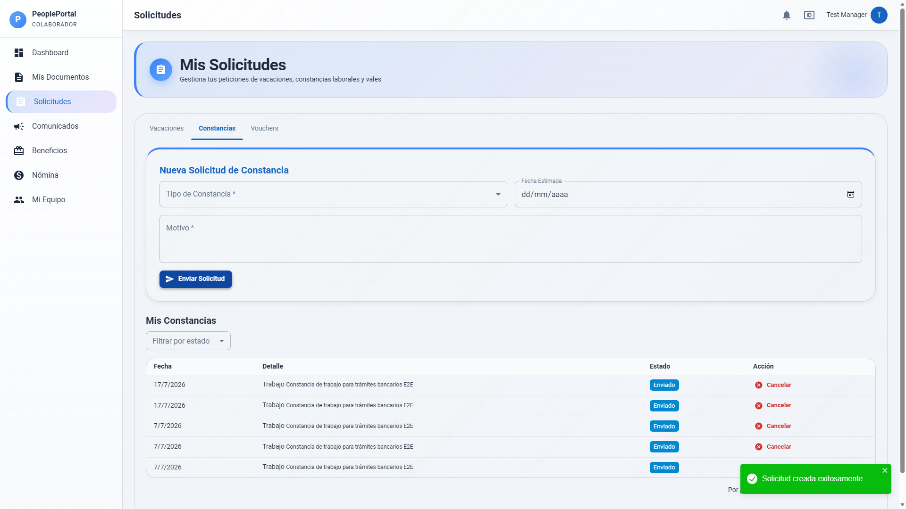 |

---

### 5. Solicitudes del Equipo

**Módulo:** Mi Equipo *(solo disponible para usuarios con rol de manager)*

El manager puede ver las solicitudes pendientes de los miembros de su equipo.

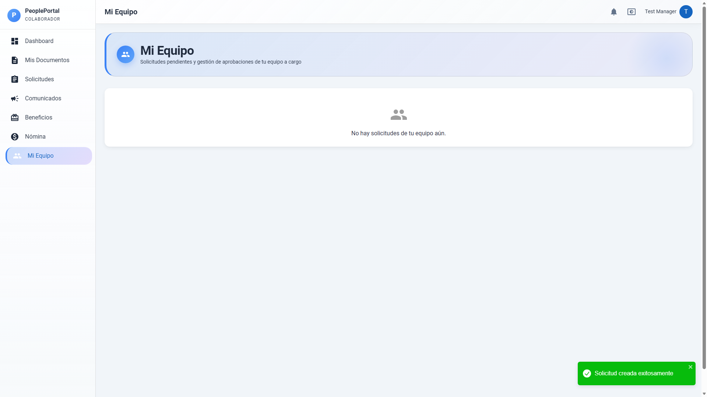

**API:** `GET /api/team/requests`

---

### 6. Comunicados

**Módulo:** Comunicados

El colaborador puede leer los comunicados internos publicados por la administración.

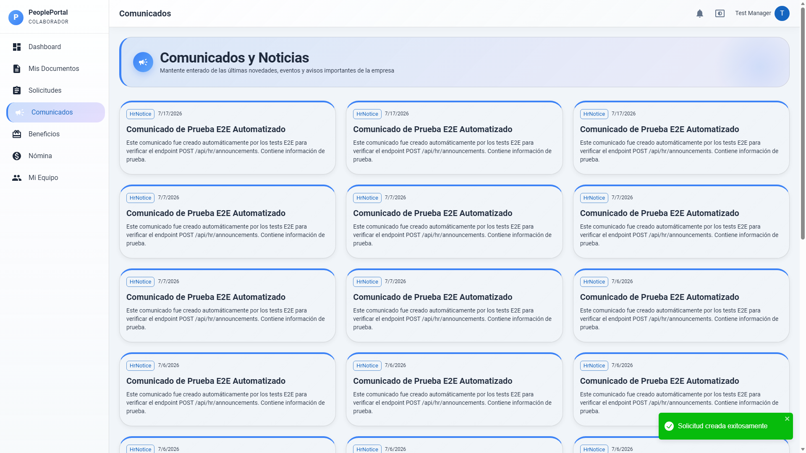

**API:** `GET /api/announcements`

---

### 7. Beneficios

**Módulo:** Beneficios

El colaborador puede ver los beneficios corporativos disponibles (Salud, Educación, Alimentación, Transporte, etc.) publicados por RRHH. La vista es de solo lectura.

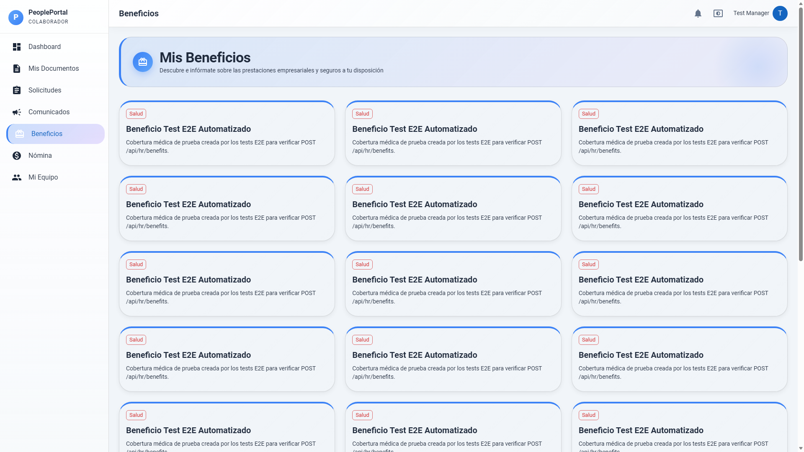

**API:** `GET /api/benefits`

---

### 8. Nómina

**Módulo:** Nómina

El colaborador puede consultar sus comprobantes de nómina. Incluye un filtro por tipo de comprobante (Comprobante de Pago, Bonificación, Adelanto, etc.).

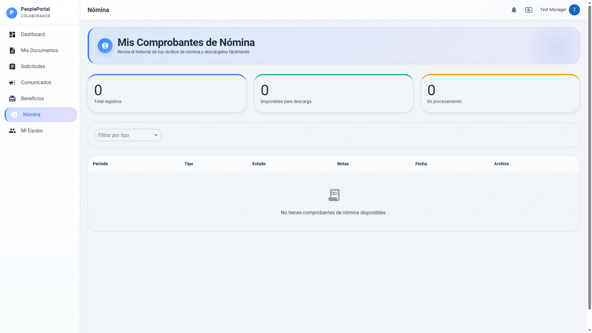

**API:** `GET /api/nomina/me`

---

### 9. Dashboard

Vista resumen con acceso a todos los módulos disponibles.

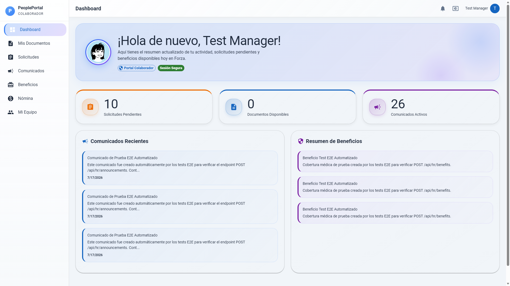

---

## Resumen de Endpoints de la API

| Método | Endpoint | Módulo | Propósito |
|---|---|---|---|
| `GET` | `/api/employees/me` | Perfil | Cargar datos del perfil |
| `PUT` | `/api/employees/me` | Perfil | Actualizar datos del perfil |
| `GET` | `/api/documents/me` | Documentos | Listar documentos personales |
| `POST` | `/api/requests/vacation` | Solicitudes | Crear solicitud de vacaciones |
| `POST` | `/api/requests/certificate` | Solicitudes | Crear solicitud de constancia |
| `GET` | `/api/announcements` | Comunicados | Listar comunicados activos |
| `GET` | `/api/benefits` | Beneficios | Listar beneficios disponibles |
| `GET` | `/api/nomina/me` | Nómina | Ver comprobantes de nómina |

---

## Pruebas Automatizadas E2E

### Resultado de la última ejecución

| Test | Resultado | Duración | Fecha |
|---|---|---|---|
| Portal Colaborador — Full Flows (POM based) | ✅ 1 passed | 29.8s | 2026-07-17 |

**Comando de ejecución:**
```bash
npx playwright test e2e-tests/full-flows.spec.js --headed
```

### Flujos cubiertos por los tests E2E

| Paso | Módulo | Acción | Endpoint verificado |
|---|---|---|---|
| 1 | Login | Autenticación con Keycloak (`testmanager` / `test123`) | — |
| 2 | Perfil | Editar teléfono, sede, contacto de emergencia → Guardar | `PUT /api/employees/me` |
| 3 | Documentos | Buscar en tabla (`contrato`) | `GET /api/documents/me` |
| 4 | Solicitudes | Crear vacaciones (fechas + motivo) + Crear constancia (tipo + motivo) | `POST /api/requests/vacation` + `POST /api/requests/certificate` |
| 5 | Mi Equipo | Verificar disponibilidad (solo managers) | — |
| 6 | Comunicados | Verificar listado | `GET /api/announcements` |
| 7 | Beneficios | Verificar tarjetas de beneficios | `GET /api/benefits` |
| 8 | Nómina | Verificar tabla de comprobantes | `GET /api/nomina/me` |
| 9 | Dashboard | Navegar al dashboard | — |

---

## Troubleshooting

| Síntoma | Causa | Solución |
|---|---|---|
| Error 401 al cargar datos | Token de sesión expirado | Cerrar sesión y volver a iniciar |
| Error 500 al obtener datos | Keycloak no disponible | Contactar al administrador del sistema |
| No aparecen documentos | Solo se muestran documentos asignados al usuario | Contactar a RRHH para que asigne el documento |
