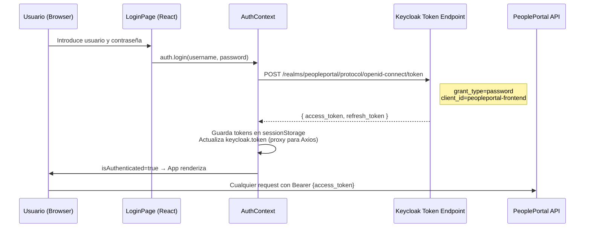
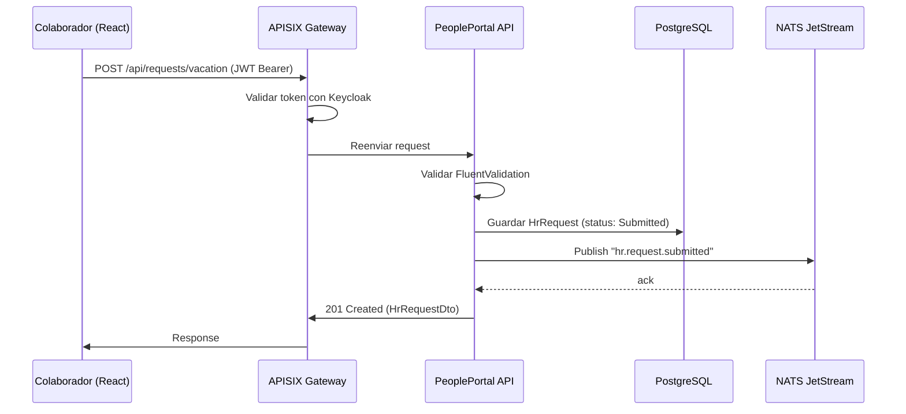
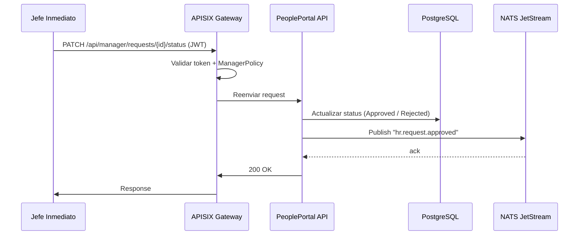
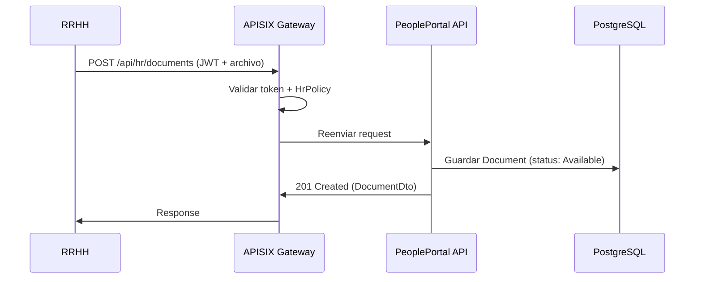
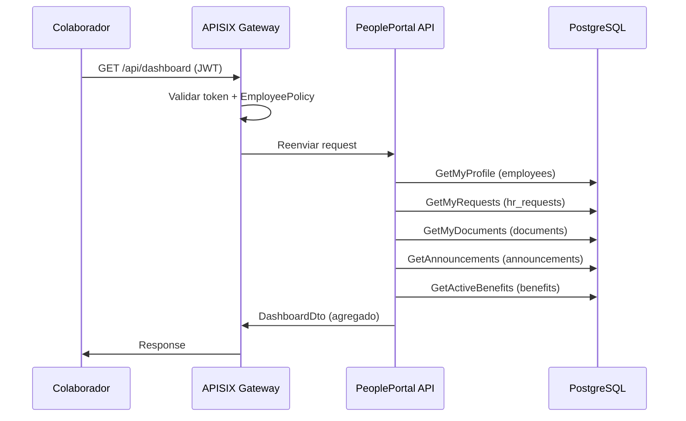
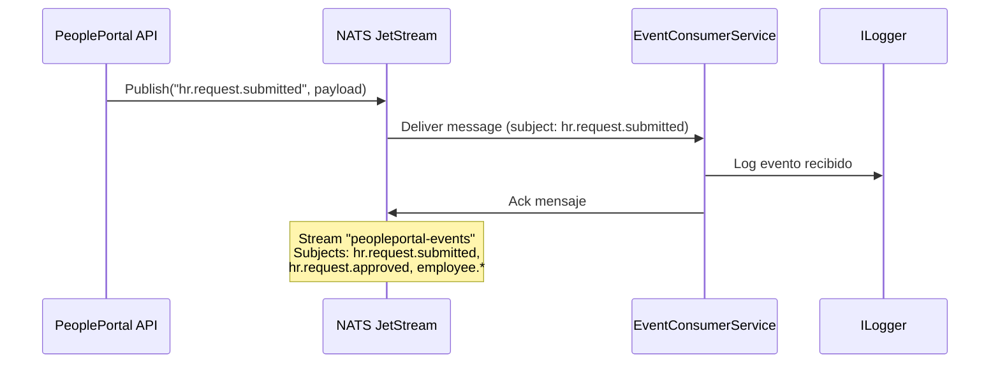

# Flujos del Sistema — PeoplePortal

## Flujo 0: Autenticación ROPC (login en ambos portales)

---

## Flujo 1: Colaborador solicita vacaciones

---

## Flujo 2: Jefe inmediato aprueba solicitud

---

## Flujo 3: RRHH sube documento a expediente

---

## Flujo 4: Colaborador consulta su Dashboard

---

## Flujo 5: Evento NATS — Consumer Service

