# Manual Técnico — Portal RRHH (Administración)

## Arquitectura del Sistema

```
  Usuario (Browser)
       │
       ▼
  ┌─────────────────────────────┐      ┌─────────────────┐
  │  Frontend React + MUI       │─────▶│  API ASP.NET     │
  │  Puerto :30082              │◀─────│  Puerto :30099   │
  │  PeoplePortal-FrontEnd-RRHH │      └────────┬────────┘
  └─────────────────────────────┘               │
                                                ▼
                                        ┌─────────────────┐
                                        │  SQL Server      │
                                        └─────────────────┘
                                                │
                                                ▼
                                        ┌─────────────────┐
                                        │  Keycloak Auth   │
                                        │  Puerto :30080   │
                                        └─────────────────┘
```

---

## Flujo de Navegación

### 1. Inicio de Sesión

El usuario administrador accede al portal y es redirigido a Keycloak para autenticarse con sus credenciales corporativas. Tras la autenticación exitosa, se presenta el Dashboard principal con acceso a todos los módulos de administración.

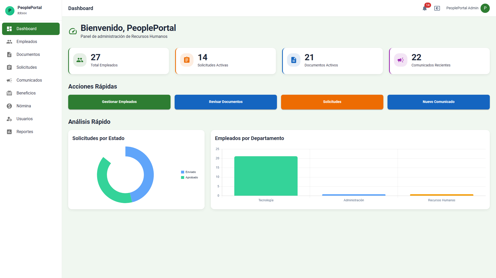

---

### 2. Gestión de Empleados

**Módulo:** Empleados

El administrador puede crear un nuevo empleado llenando un formulario con sus datos personales y laborales.

**Campos del formulario:**

| Campo | Descripción |
|---|---|
| Código | Identificador único del empleado |
| Nombre Completo | Nombre del empleado |
| Email | Correo electrónico corporativo |
| Departamento | Área de trabajo |
| Puesto | Cargo dentro de la organización |
| Fecha de Contratación | Fecha de inicio |
| Tipo de Contrato | Indefinido, Temporal, etc. |
| Teléfono | Número de contacto |
| Sitio | Ubicación física |
| Contacto de Emergencia | Persona a contactar |

| Formulario de creación lleno | Confirmación de creación |
|---|---|
| 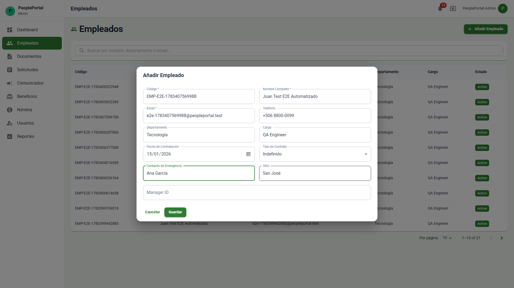 | 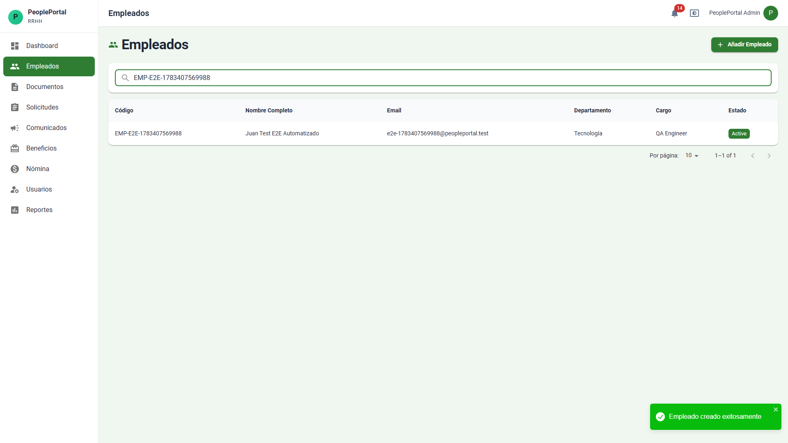 |

**API:** `POST /api/hr/employees`

---

### 3. Gestión de Documentos

**Módulo:** Documentos

El administrador puede subir documentos y asignarlos a un empleado específico. El formulario permite seleccionar el empleado, ingresar el nombre del documento, el tipo y la URL del archivo.

| Formulario de carga lleno | Confirmación de carga |
|---|---|
| 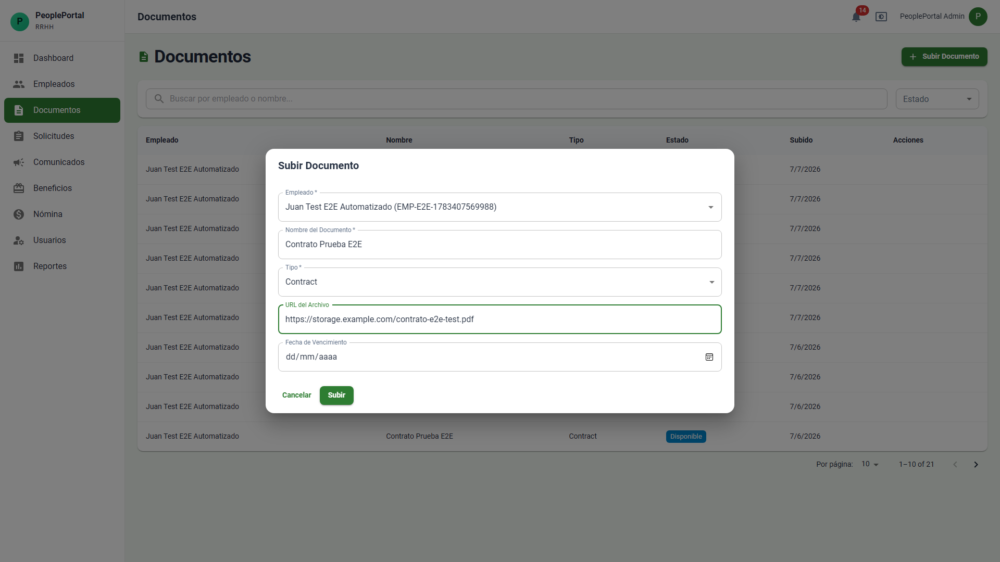 | 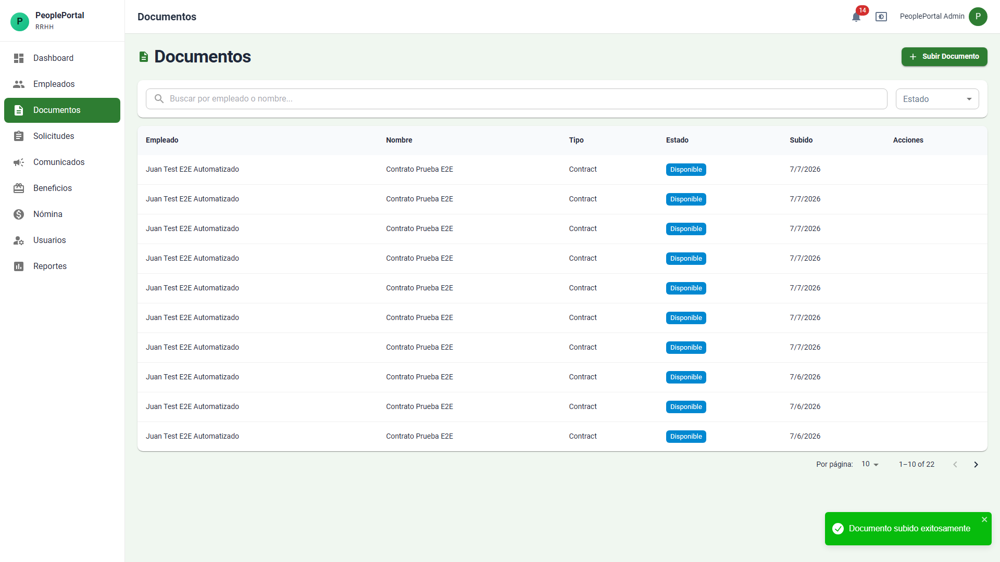 |

**API:** `POST /api/hr/documents`

---

### 4. Aprobación de Solicitudes

**Módulo:** Solicitudes

El administrador puede filtrar las solicitudes de los empleados por tipo (Vacaciones, Permisos, etc.) y aprobarlas o rechazarlas directamente desde la lista.

| Lista con filtro aplicado | Solicitud aprobada |
|---|---|
| 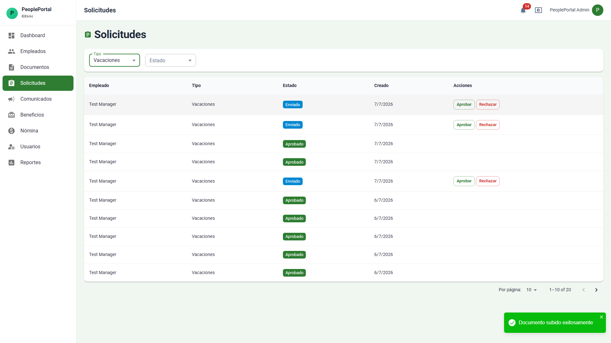 | 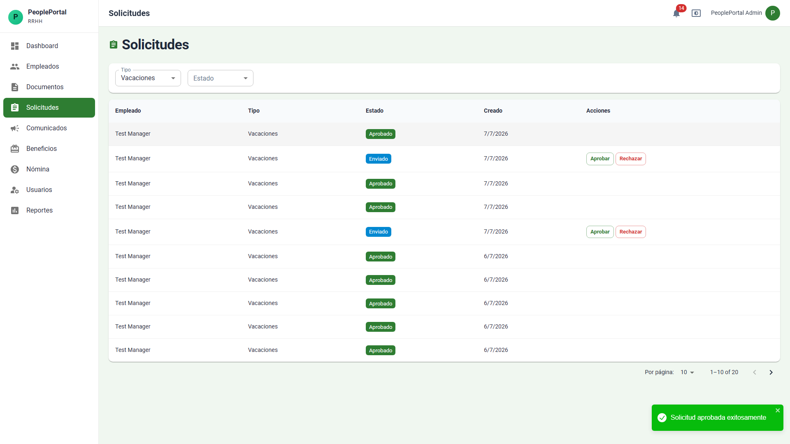 |

**API:** `PATCH /api/hr/requests/{id}/status`

---

### 5. Gestión de Comunicados

**Módulo:** Comunicados

El administrador puede crear comunicados internos con título, tipo, fecha de expiración y cuerpo del mensaje. Los comunicados activos son visibles para todos los colaboradores.

| Formulario de creación lleno | Confirmación de creación |
|---|---|
| 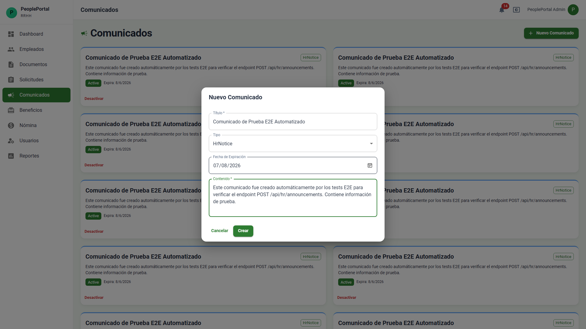 | 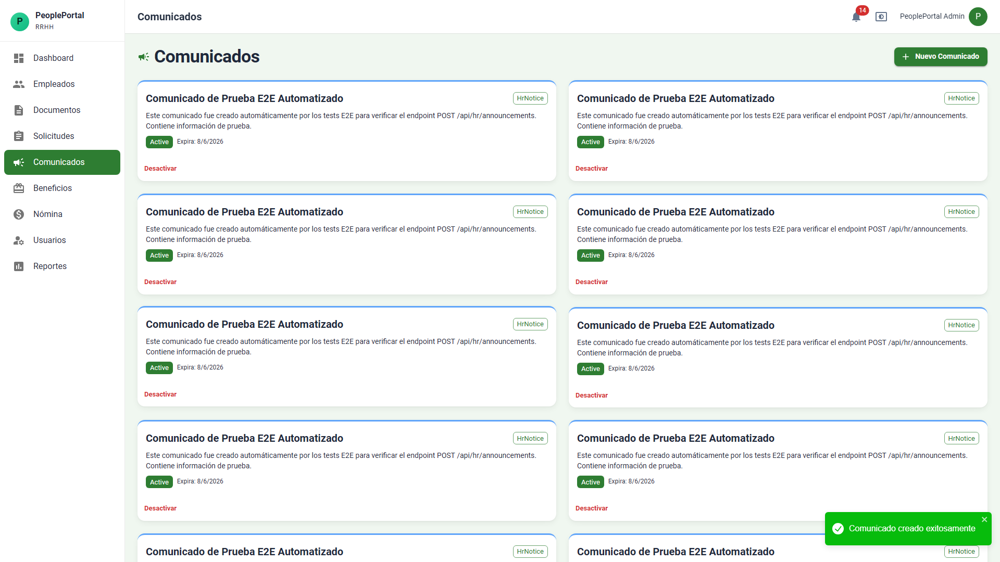 |

**API:** `POST /api/hr/announcements`

---

### 6. Gestión de Beneficios

**Módulo:** Beneficios

El administrador puede registrar beneficios corporativos (Salud, Educación, Bienestar, etc.) que los colaboradores podrán canjear posteriormente.

| Formulario de creación lleno | Confirmación de creación |
|---|---|
| 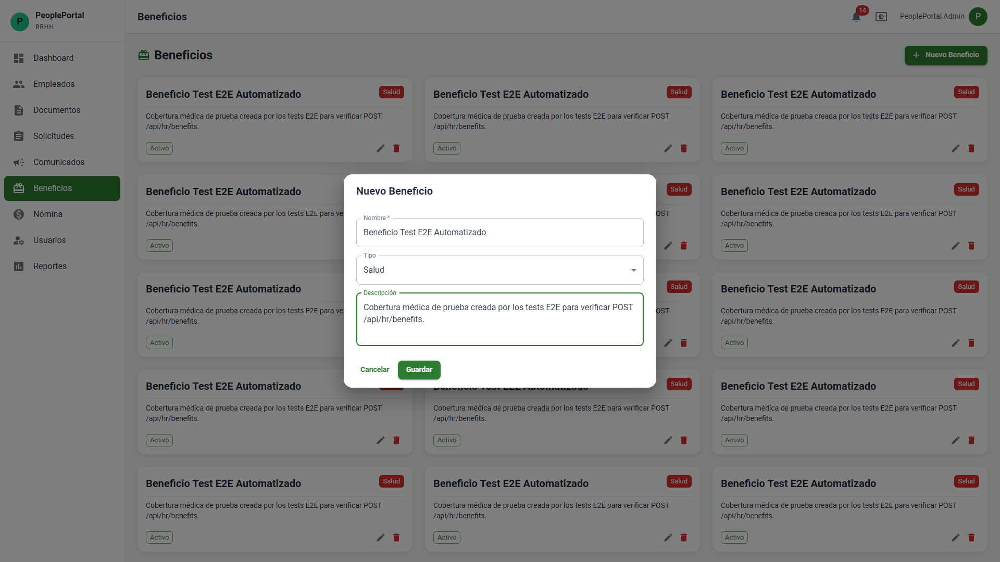 | 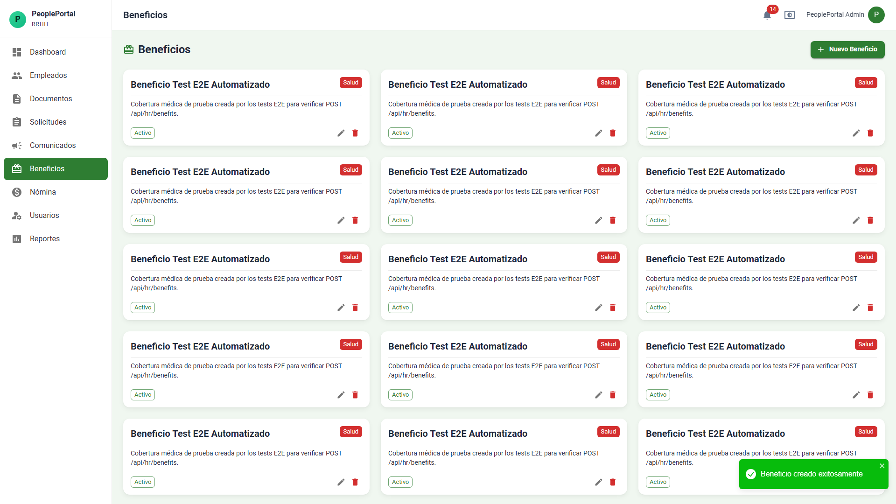 |

**API:** `POST /api/hr/benefits`

---

### 7. Gestión de Nómina

**Módulo:** Nómina

El administrador puede crear registros de nómina seleccionando el empleado, el tipo de comprobante, el período (mes/año) y agregando notas.

| Formulario de registro lleno | Confirmación de creación |
|---|---|
| 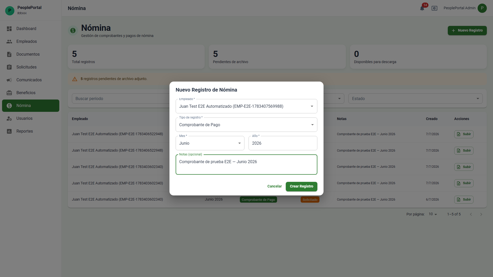 | 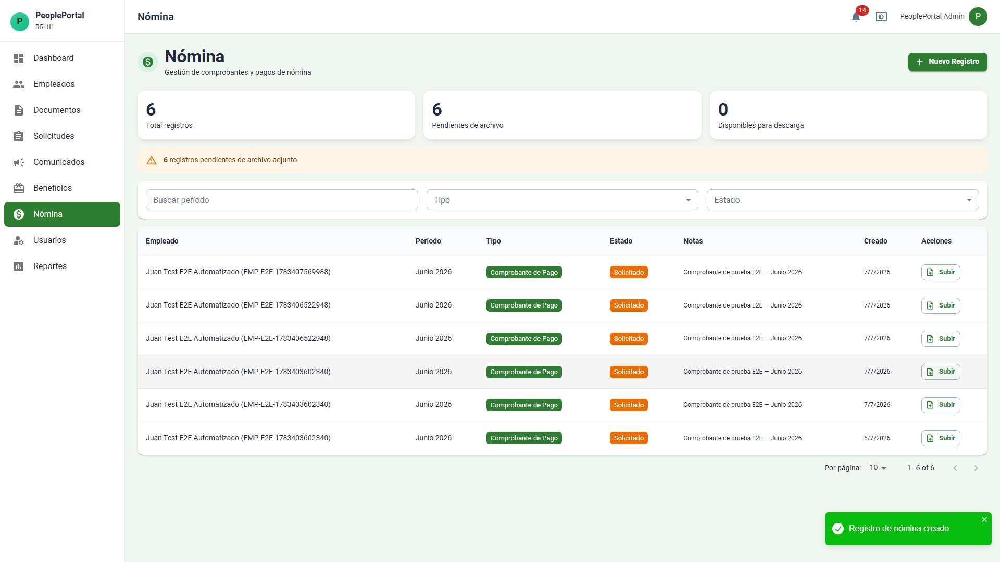 |

**API:** `POST /api/hr/nomina`

---

### 8. Gestión de Usuarios del Sistema

**Módulo:** Usuarios

El administrador puede crear cuentas de usuario para que los empleados accedan al sistema. Las cuentas se crean con credenciales temporales.

| Formulario de creación lleno | Confirmación de creación |
|---|---|
| 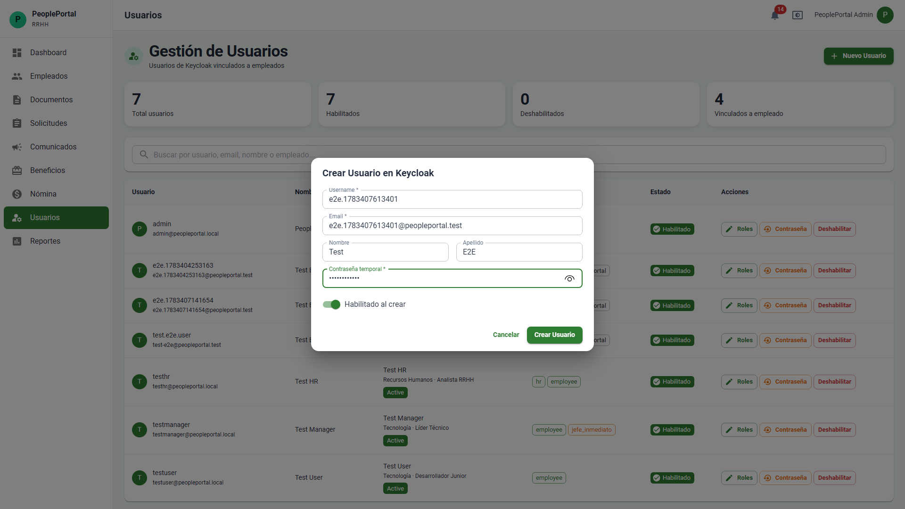 | 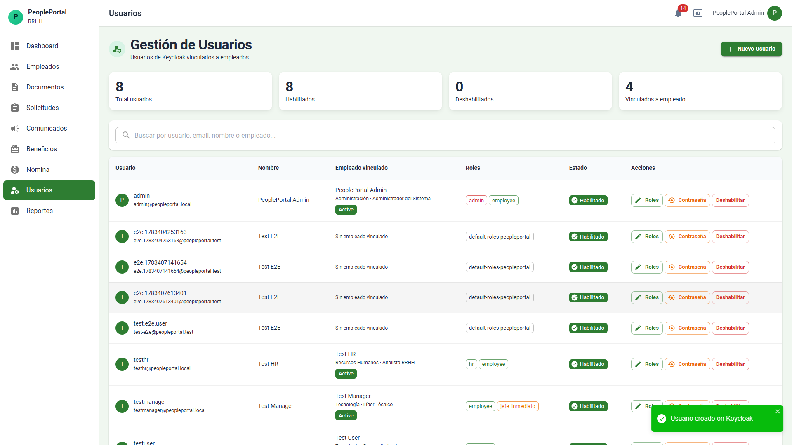 |

**API:** `POST /api/hr/users`

---

### 9. Reportes

**Módulo:** Reportes

Panel de reportes con métricas y estadísticas del personal.

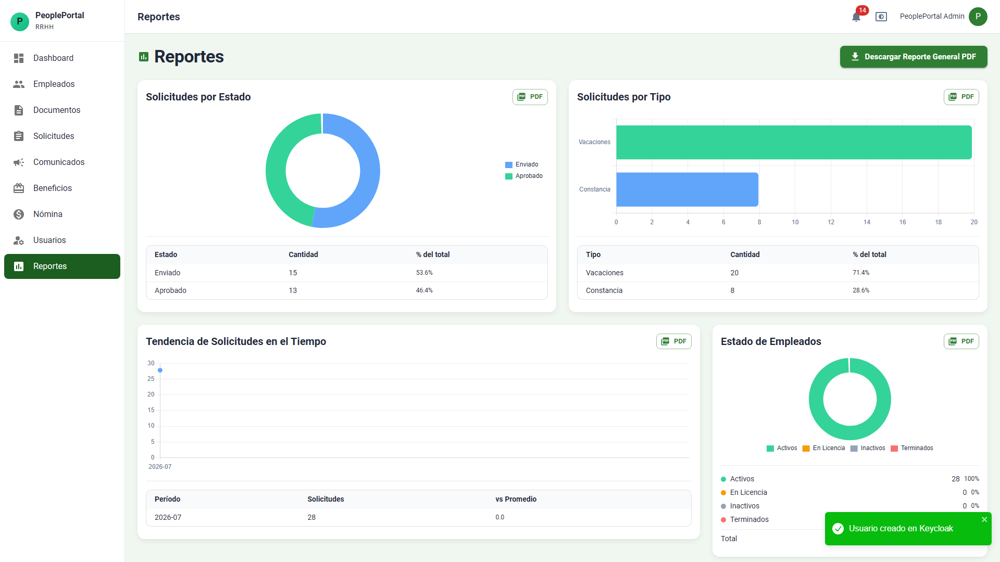

**API:** `GET /api/hr/reports`

---

### 10. Dashboard

Vista resumen del sistema con acceso a todos los módulos.

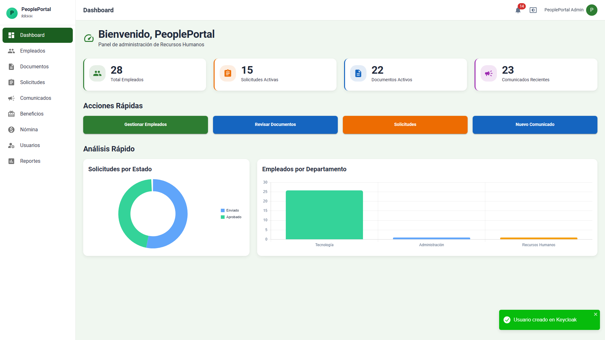

---

## Resumen de Endpoints de la API

| Método | Endpoint | Módulo | Propósito |
|---|---|---|---|
| `POST` | `/api/hr/employees` | Empleados | Crear un empleado |
| `POST` | `/api/hr/documents` | Documentos | Subir un documento |
| `PATCH` | `/api/hr/requests/{id}/status` | Solicitudes | Aprobar o rechazar una solicitud |
| `POST` | `/api/hr/announcements` | Comunicados | Crear un comunicado |
| `POST` | `/api/hr/benefits` | Beneficios | Crear un beneficio |
| `POST` | `/api/hr/nomina` | Nómina | Crear un registro de nómina |
| `POST` | `/api/hr/users` | Usuarios | Crear un usuario del sistema |
| `GET` | `/api/hr/reports` | Reportes | Obtener reportes |

---

## Troubleshooting

| Síntoma | Causa | Solución |
|---|---|---|
| Error 401 al cargar datos | Token de sesión expirado | Cerrar sesión y volver a iniciar |
| Error 500 en usuarios | Keycloak no disponible | Contactar al administrador del sistema |
| Selectores sin opciones | Error de carga de datos | Recargar la página |
